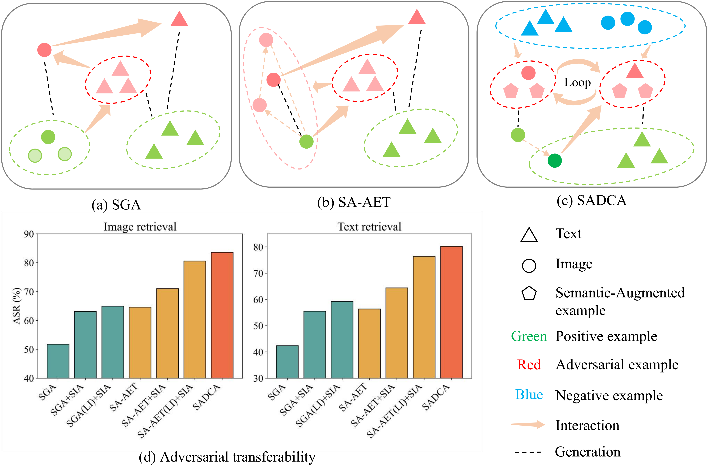
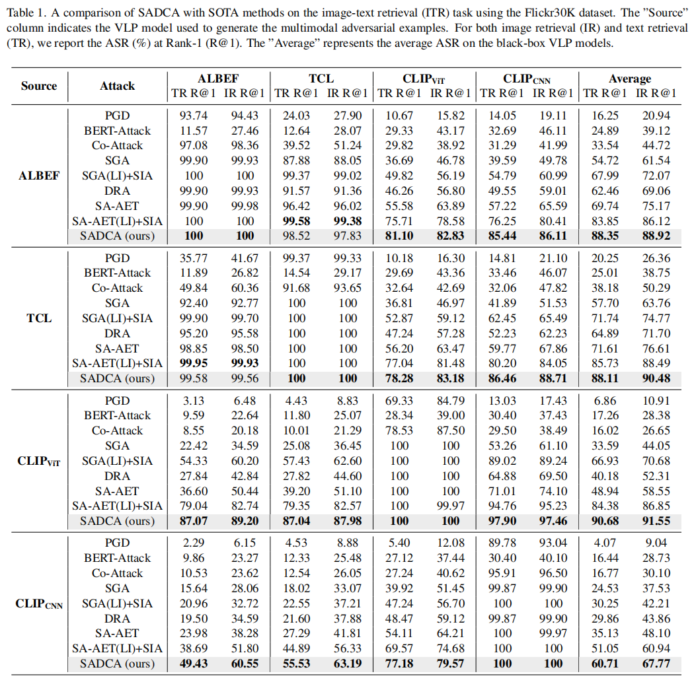
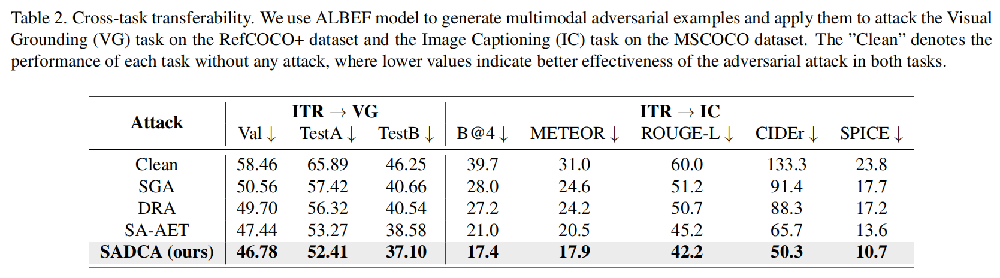
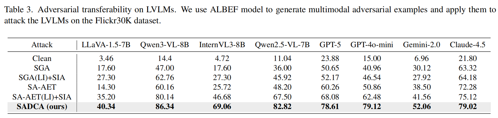

# Towards Highly Transferable Vision-Language Attack via Semantic-Augmented Dynamic Contrastive Interaction

This repository is the official implementation of *Towards Highly Transferable Vision-Language Attack via Semantic-Augmented Dynamic Contrastive Interaction*.
[[Paper](https://arxiv.org/abs/2603.04846)]


<div align="center">
    
</div>

> *A comparison of our SADCA and existing frameworks. 
> (a) and (b) illustrate the core concepts of SGA and SA-AET, respectively, where only one or two static interactions are performed between the visual and textual modalities, with the interactions being limited solely to positive pairs. 
> (c) illustrates the core idea of the proposed SADCA, which continuously disrupts cross-modal interactions through dynamic contrastive interactions with both positive and negative pairs. 
> Additionally, it leverages a semantic augmentation strategy to enrich the data samples, thereby diversifying the semantic information. 
> The arrow represents the interaction between the visual and textual modalities. 
> The dotted lines represent the generation of adversarial examples from the original examples. 
> (d) demonstrate the effectiveness of the input transformation in enhancing the adversarial attack transferability. 
> Furthermore, we observe that using large number of iterations (LI) to attack the image modality can further improve the attack performance.*


## Quick Start 

### 1. Install dependencies
```bash
conda create -n SADCA python=3.10
conda activate SADCA
pip install torch==2.1.0 torchvision==0.16.0 --index-url https://download.pytorch.org/whl/cu121
pip install -r requirements.txt
```

### 2. Prepare datasets and models

Download the datasets, [Flickr30k](https://shannon.cs.illinois.edu/DenotationGraph/) and [MSCOCO](https://cocodataset.org/#home) (the annotations is provided in ./data_annotation/). Set the root path of the dataset in `./configs/Retrieval_flickr.yaml, image_root`.  
The checkpoints of the fine-tuned VLP models is accessible in [ALBEF](https://github.com/salesforce/ALBEF), [TCL](https://github.com/uta-smile/TCL), [CLIP](https://huggingface.co/openai/clip-vit-base-patch16).

Download the datasets from this [link](https://drive.google.com/file/d/1y2ftRLUxD8Fl0V38PJdBf8_F6xB5vNZs/view?usp=sharing).

Download the ALBEF and TCL Pre-Trained models from this [link](https://huggingface.co/Sensen02/VLPTransferAttackCheckpoints) to the checkpoints file.

Download the bert-base-uncased from this [link](https://drive.google.com/file/d/1LiDYe9uiohULmxpqH9XXzaCqkm0vuvkE/view?usp=drive_link)


## Transferability Evaluation

### 1. Cross-model adversarial transferability

We provide `eval_SADCA.py` for **Image-Text Retrieval** Attack Evaluation，

Here is an example for Flickr30K dataset.

```bash
python eval_SADCA.py --config ./configs/Retrieval_flickr.yaml \
	--cuda_id 0 \
	--source_model CLIP_CNN \
	--albef_ckpt ./checkpoints/albef_flickr.pth \
	--tcl_ckpt ./checkpoints/tcl_flickr.pth \
	--original_rank_index_path ./std_eval_idx/flickr30k/ \
	--result_file_path ./flickr30k_adv/result_SADCA.txt \
	--save_advimg_path ./flickr30k_adv/SADCA_CLIP_CNN/ \
	--save_advimg_caption_path ./flickr30k_adv/SADCA_CLIP_CNN.json
```

Here is an example for MSCOCO dataset.

```bash
python eval_SADCA.py --config ./configs/Retrieval_coco.yaml \
	--cuda_id 0 \
	--source_model CLIP_CNN \
	--albef_ckpt ./checkpoints/albef_mscoco.pth \
	--tcl_ckpt ./checkpoints/tcl_mscoco.pth \
	--original_rank_index_path ./std_eval_idx/coco/ \
	--result_file_path ./mscoco_adv/result_SADCA.txt \
	--save_advimg_path ./mscoco_adv/SADCA_CLIP_CNN/ \
	--save_advimg_caption_path ./mscoco_adv/SADCA_CLIP_CNN.json
```

**Main Results:**

<div align="left">
    
</div>


### 2. Cross-task adversarial transferability

We present two cross-task attack evaluations, ITR->VG and ITR->IC.

**ITR->VG:**

First, please use the **MSCOCO** dataset and the provided files `./data_annotation/refcoco+_test_for_adv.json` and `./data_annotation/refcoco+_val_for_adv.json` to generate adversarial images(3K images).

After that, please refer to `Grouding.py` (use '--evaluate') in [ALBEF](https://github.com/salesforce/ALBEF), and replace the clean images in the MSCOCO dataset with the adversarial images. Then, you can get the performance of the ALBEF model on the adversarial images, corresponding to the Val, TestA, and TestB metrics.

**ITR->IC:**

First, please use the **MSCOCO** dataset and the provided files `./data_annotation/coco_karpathy_test.json` and `./data_annotation/coco_karpathy_val.json` to generate adversarial images(10K images).

After that, please refer to `train_caption.py` (use '--evaluate') in [BLIP](https://github.com/salesforce/BLIP), and replace the clean images in the MSCOCO dataset with the adversarial images. Then, you can get the performance of the ALBEF model on the adversarial images, corresponding to the B@4, METEOR, ROUGE-L, CIDEr and SPICE metrics.

**Main Results:**

<div align="left">
    
</div>


### 3. Adversarial transferability on LVLMs

Employ the binary decision template **"Does the picture depict that 'adversarial text'? Only answer Yes or No."** to construct adversarial text prompts.
Then combine adversarial text prompts and adversarial image to send LVLMs.

**Main Results:**

<div align="left">
    
</div>


## Visualization

### 1. Visualization on Multimodal Dataset

<div align="left">
    
</div>

### 2. Visualization on Image Captioning and Visual Grounding

<div align="left">
    
</div>

### 3. Visualization on LVLMs

<div align="left">
    
</div>

[//]: # (## Citation)

[//]: # ()
[//]: # (```)

[//]: # (@article{gao2024boosting,)

[//]: # (  title={Boosting Transferability in Vision-Language Attacks via Diversification along the Intersection Region of Adversarial Trajectory},)

[//]: # (  author={Gao, Sensen and Jia, Xiaojun and Ren, Xuhong and Tsang, Ivor and Guo, Qing},)

[//]: # (  journal={arXiv preprint arXiv:2403.12445},)

[//]: # (  year={2024})

[//]: # (})

[//]: # (```)
